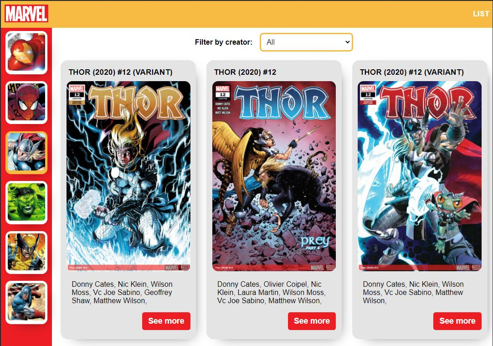
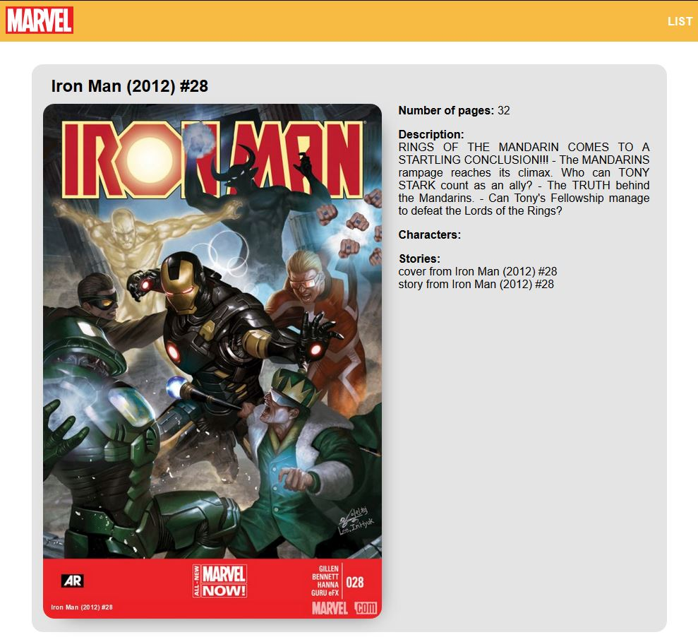

# TO-DO list using javaScript

> This project is a single page application built with React and Redux, All data that was retrieved from the Marvel developers 
> API and is stored in the Redux store, also you can filter by creators to see the comics that the creator selected worked in.
## Built With

- React
- Redux
- md5
- redux-thunk.
- styled-components.

## Demo Screenshots

## Live Demo

[Live version](https://eloquent-mcnulty-f14c04.netlify.app/)

## Prerequisites

node: v12.19.0
## Getting Started
To get a local copy up and running follow these simple example steps.

- Open a terminal or command prompt interface on your PC.
- Clone the repo with: `git clone https://github.com/kenderb/marvel-catalogue.git`
- On the terminal navigate to the project directory using `cd marvel-catalogue/`

## 📝 Setup

1. On the terminal navigate to the project directory using `cd marvel-catalogue/`.
2. Install dependencies using: `npm install`.
2. Run a server using: `npm start`.
3. Open `http://localhost:3000/` in your browser or open the index.html on your browser.

## :straight_ruler: Running test

1. On the terminal navigate to the project directory using `cd marvel-catalogue/`.
2. Run the test with: `npm test`.

## Authors

👤 **Kender Bolivar**

- GitHub: [@kenderb](https://github.com/ken)
- Twitter: [@KBTarts](https://twitter.com/KBTarts )
- LinkedIn: [KenderBolivar](https://www.linkedin.com/in/kender-bolivar-1736086b/ )

## 🤝 Contributing

Contributions, issues and feature requests are welcome!

Feel free to check the [issues page](https://github.com/kenderb/marvel-catalogue/issues).

## Show your support

Give a ⭐️ if you like this project!

## :grey_exclamation: Acknowledgments

- Stack Overflow.
- Odin Project.
- Marvel API.

## 📝 License

[MIT LICENSE](LICENSE)